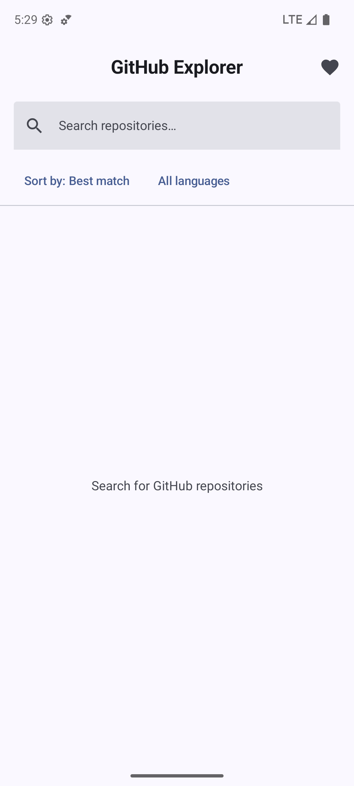
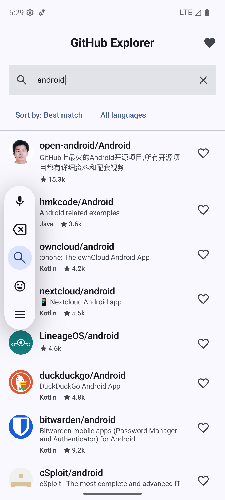
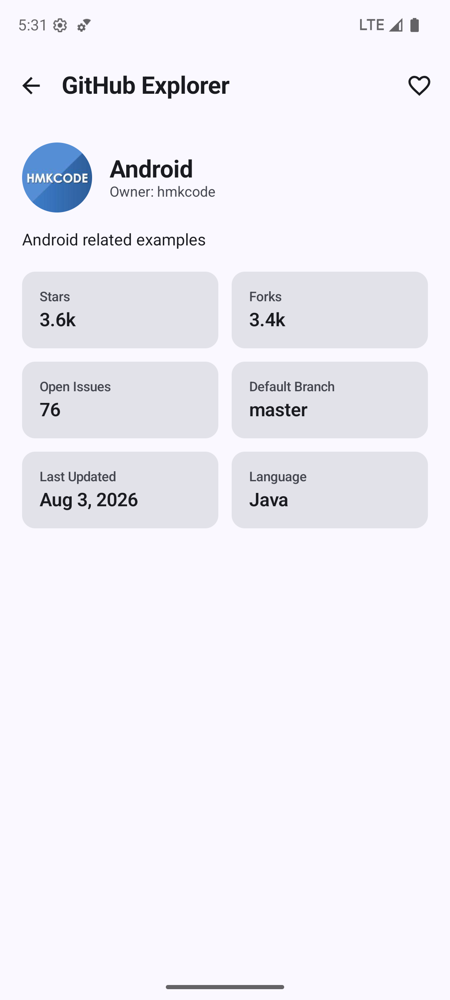
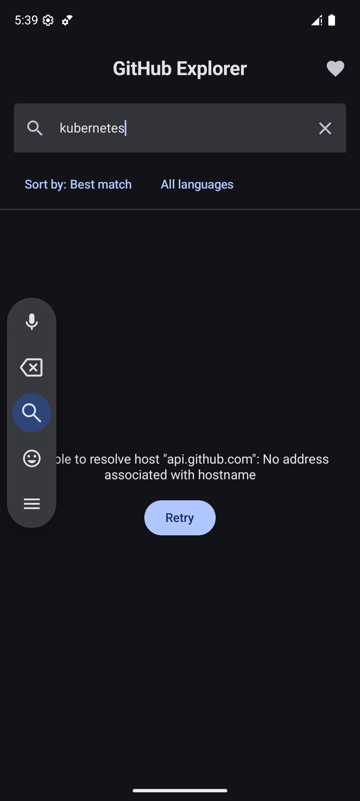

# GitHub Explorer

A GitHub Repository Explorer built with Jetpack Compose, Clean Architecture, and MVVM.
Search public repositories via the GitHub Search API, view details, favorite repos for
offline access, and page through results infinitely.

## Screenshots

| Search | Results | Details |
|---|---|---|
|  |  |  |

| Favorites | Dark mode | Error + Retry |
|---|---|---|
|  |  |  |

## Architecture

Clean Architecture with three layers, each depending only inward (`presentation` → `domain` ← `data`):

```
presentation/   Compose UI + ViewModels (MVVM). Talks only to domain/usecase.
domain/         Pure Kotlin: models, repository interfaces, use cases. No Android imports.
data/           Retrofit API, Room database, mappers, and the GithubRepository implementation.
core/           Cross-cutting: Hilt modules, shared UiState/AppResult wrappers, formatters.
```

- **MVVM**: each screen has a `ViewModel` exposing `StateFlow`/`PagingData` state; Composables are
  stateless and receive state + event lambdas.
- **Dependency inversion**: `domain.repository.GithubRepository` is an interface; `data.repository.GithubRepositoryImpl`
  is the only implementation, bound via Hilt (`@Binds` in `RepositoryModule`). ViewModels and use cases
  depend on the interface, never the implementation.
- **Use cases**: one class per operation (`SearchRepositoriesUseCase`, `GetRepositoryDetailsUseCase`,
  `ToggleFavoriteUseCase`, etc.) — thin wrappers that keep ViewModels free of repository details and
  keep each unit trivially testable.

## Folder Structure

```
app/src/main/java/com/kanthi/githubrepoexplorer/
├── core/
│   ├── common/        AppResult<T> (data/domain result wrapper), UiState<T> (screen state)
│   ├── di/             NetworkModule, DatabaseModule, RepositoryModule (Hilt)
│   └── util/           DateFormatter, CountFormatter
├── data/
│   ├── remote/api/     GithubApiService (Retrofit)
│   ├── remote/dto/     RepositoryDto, OwnerDto, SearchRepositoriesResponseDto
│   ├── local/db/        AppDatabase (Room)
│   ├── local/entity/    RepositoryEntity, SearchHistoryEntity
│   ├── local/dao/       RepositoryDao, SearchHistoryDao
│   ├── mapper/          DTO/Entity <-> domain model mappers
│   ├── paging/          RepositorySearchPagingSource (Paging 3)
│   └── repository/      GithubRepositoryImpl
├── domain/
│   ├── model/           Repository, SortOption
│   ├── repository/      GithubRepository (interface)
│   └── usecase/         One class per operation
└── presentation/
    ├── search/           SearchScreen + SearchViewModel
    ├── details/          DetailsScreen + DetailsViewModel
    ├── favorites/        FavoritesScreen + FavoritesViewModel
    ├── components/       RepositoryListItem, loading/error/empty state composables
    ├── navigation/       Screen routes + NavHost
    └── theme/            Material 3 theme (light/dark, dynamic color)
```

## Libraries Used

| Purpose | Library |
|---|---|
| UI | Jetpack Compose, Material 3 |
| Navigation | Navigation Compose |
| DI | Hilt |
| Networking | Retrofit + OkHttp + Gson |
| Pagination | Paging 3 (`paging-compose`, `paging-runtime`) |
| Local persistence | Room |
| Async | Kotlin Coroutines + Flow |
| Image loading | Coil 3 |

## Design Decisions

- **Search-as-you-type with debounce**: the search box drives a 500ms-debounced,
  `distinctUntilChanged` query that feeds a Paging 3 `Pager` via `flatMapLatest`, so results
  update live without hammering GitHub's (unauthenticated, 10 req/min) search endpoint on
  every keystroke.
- **Query-keyed paging collector**: Paging 3 intentionally *keeps* the previous page's items on
  screen when a refresh fails, to support classic pull-to-refresh UX. That's wrong for a new,
  distinct search — showing the old query's results next to a "failed to load" error is
  misleading. The Compose collector is wrapped in `key(searchKey)` so every new committed query
  gets a fresh `LazyPagingItems` instance instead of silently reusing stale state.
- **One shared `Repository` domain model** for both the list and details screens: the GitHub
  search API response already returns everything the "Details" screen needs (stars, forks, open
  issues, default branch, updated date), so a second, differently-shaped model would just be
  duplication. The details screen still does its own network call (`GET /repos/{owner}/{repo}`)
  for fresher/more complete data, rather than trusting stale search-result data passed via
  navigation args.
- **Favorites and offline details as the offline story**: rather than caching every paginated
  search result (which fights Paging 3's page-based model), only what the user has explicitly
  favorited or opened is persisted to Room. Favoriting a repo, or viewing its details once,
  makes it available offline; a fresh, never-opened search is honestly shown as an error with
  retry when there's no connection — no misleading "results" made of stale placeholder data.
- **Sort and language filter map directly onto GitHub's query syntax** (`sort=stars&order=desc`,
  `q=<query> language:<lang>`) rather than client-side filtering/sorting, since the API already
  supports it and client-side filtering would silently disagree with "load more" pagination.
- **Result wrapper**: `AppResult<T>` (data/domain boundary, one-shot calls) and `UiState<T>`
  (screen state: Loading/Success/Error) are kept separate — `AppResult` never leaks Android/UI
  concerns, `UiState` is what ViewModels expose to Compose.

## Requirements

- Android Studio (AGP 9.2.1 / Kotlin 2.4.0)
- minSdk 26, targetSdk 35, compileSdk 37
- No API key required — uses GitHub's public, unauthenticated Search API
  (rate-limited to 10 requests/minute; if search results stop updating, that's most likely why).

## Running

```bash
./gradlew assembleDebug
```

Or open in Android Studio and run the `app` configuration.

## Testing

62 unit tests across every layer — no instrumentation/emulator required:

```bash
./gradlew testDebugUnitTest
```

| Layer | Covered by |
|---|---|
| `core/util` | `CountFormatterTest`, `DateFormatterTest` — pure formatting logic |
| `data/mapper` | `RepositoryMappersTest` — DTO/Entity ↔ domain model conversions |
| `data/paging` | `RepositorySearchPagingSourceTest` — first page, empty page, network failure, language qualifier, sort param, append pagination (via `androidx.paging:paging-testing`'s `TestPager`) |
| `data/repository` | `GithubRepositoryImplTest` — favorite toggling, offline fallback to cache, search history |
| `domain/usecase` | `UseCasesTest` — each use case forwards the right arguments to the repository |
| `presentation` | `SearchViewModelTest`, `DetailsViewModelTest`, `FavoritesViewModelTest` — debounce timing, loading/success/error states, favorite state propagation |

Tests use MockK for mocking, Turbine for `Flow` assertions, and `kotlinx-coroutines-test`
(`StandardTestDispatcher` + a `MainDispatcherRule`) for deterministic coroutine/virtual-time
control — including the search box's 500ms debounce, verified without any real delay.
